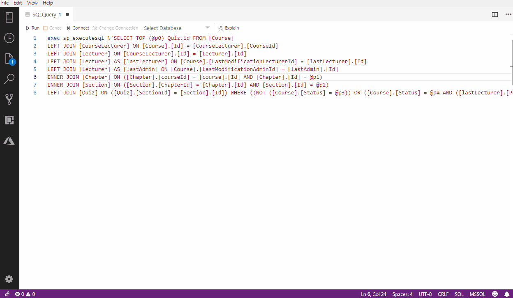

# Convert sp_executesql to sql

This extension can be helpful in debugging SQL query executed by your application (e.g some of ORM like EF)

## Features

press `F1` and type `Convert` command to run convertor on active query.

## Installation
The current release is available to [download as a .vsix file](https://github.com/PejmanNik/sqlops-spexecutesql-to-sql/releases/download/v0.0.1/sqlops-spexecutesql-to-sql-0.0.1.vsix) and can be installed by opening the command palette (`ctrl/command+shift+p`) and selecting `Extensions: Install from VSIX...`

## Release Notes

### 0.0.1

Initial release